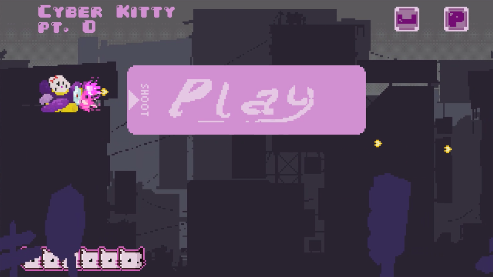
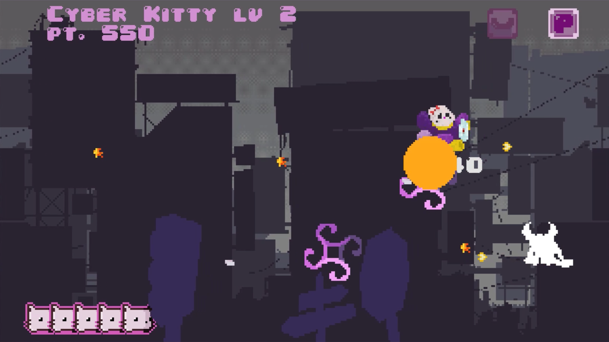

# CyberKitty 
## Run and play
To correctly execute CyberKitty open the cloned directory in you IDE of choice because relative paths are used to refer files and assets. 

Use this *keys* in the game window:
-  restart **R**
-  move **WASD**
-  shoot **L**
-  shrink **P**
-  dash **SPACE**
-  quit **V**

**Shoot with your bullets the *"Play"* button or collide with it to start the game**
[WATCH GAME TRAILER HERE](https://youtu.be/_P9crFPv-q0)
## Game
"**Cyber Kitty**" is a 2D endless scroll python game developed with the focus on a great visual experience, a frenetic gameplay and clean and optimized code.

You will be playing as *Kitty*, a cat flying on an armed purple airplane that can shoot gold bullet hearts, aggressively dash towards enemies and shrink in size to dodge the attacks.
The game has 4 stages unlocked at 400, 800 and 1400 points. At each new stage of the game it becomes harder to survive with more and different types of enemies.

## Art and assets
I have personally drew many of the sprites for the game 

The rest of the assets were found as free resources that i then modified to metch the aesthetics and the general pixel ratio of the game.
## enjoy 
